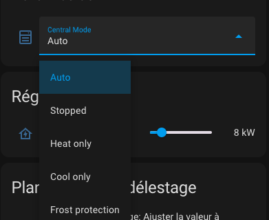

## Le contrôle centralisé

Depuis la release 5.2, si vous avez défini une configuration centralisée, vous avez une nouvelle entité nommée `select.central_mode` qui permet de piloter tous les VTherms avec une seule action. Pour qu'un VTherm soit contrôlable de façon centralisée, il faut que son attribut de configuration nommé `use_central_mode` soit vrai.

Cette entité se présente sous la forme d'une liste de choix qui contient les choix suivants :
1. `Auto` : le mode 'normal' dans lequel chaque VTherm se comporte comme dans les versions précédentes,
2. `Stooped` : tous les VTherms sont mis à l'arrêt (`hvac_off`),
3. `Heat only` : tous les VTherms sont mis en mode chauffage lorsque ce mode est supporté par le VTherm, sinon il est stoppé,
3. `Cool only` : tous les VTherms sont mis en mode climatisation lorsque ce mode est supporté par le VTherm, sinon il est stoppé,
4. `Frost protection` : tous les VTherms sont mis en preset hors-gel lorsque ce preset est supporté par le VTherm, sinon il est stoppé.

Il est donc possible de contrôler tous les VTherms (que ceux que l'on désigne explicitement) avec un seul contrôle.
Exemple de rendu :

