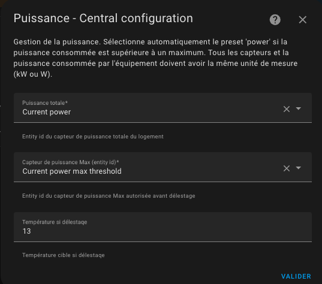

# Gestion de la puissance - délestage

## Configurer la gestion de la puissance

Si vous avez choisi la fonctionnalité ```Avec détection de la puissance```, cliquez sur 'Valider' sur la page précédente et vous arriverez ici :



Cette fonction vous permet de réguler la consommation électrique de vos radiateurs. Connue sous le nom de délestage, cette fonction vous permet de limiter la consommation électrique de votre appareil de chauffage si des conditions de surpuissance sont détectées. Donnez un **capteur à la consommation électrique actuelle de votre maison**, un **capteur à la puissance max** qu'il ne faut pas dépasser, la **consommation électrique totale des équipements du VTherm** (en étape 1 de la configuration) et l'algorithme ne démarrera pas un radiateur si la puissance maximale sera dépassée après le démarrage du radiateur.

Notez que toutes les valeurs de puissance doivent avoir les mêmes unités (kW ou W par exemple).
Cela vous permet de modifier la puissance maximale au fil du temps à l'aide d'un planificateur ou de ce que vous voulez.

>  _*Notes*_
> 1. En cas de délestage, le radiateur est réglé sur le préréglage nommé ```power```. Il s'agit d'un préréglage caché, vous ne pouvez pas le sélectionner manuellement.
> 2. Je l'utilise pour éviter de dépasser la limite de mon contrat d'électricité lorsqu'un véhicule électrique est en charge. Cela crée une sorte d'autorégulation.
> 3. Gardez toujours une marge, car la puissance max peut être brièvement dépassée en attendant le calcul du prochain cycle typiquement ou par des équipements non régulés.
> 4. Si vous ne souhaitez pas utiliser cette fonctionnalité, laissez simplement l'identifiant des entités vide
> 5. Si vous controlez plusieurs radiateurs, la **consommation électrique de votre chauffage** renseigné doit correspondre à la somme des puissances.