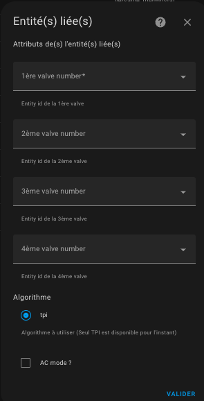

# Thermostat de type `thermostat_over_valve`

>  _*Notes*_
> 1. Le type `over_valve` est souvent confondu avec le type `over_climate` équipé d'une auto-régulation avec pilotage direct de la vanne,
> 2. vous ne devriez choisir ce type que lorsque vous n'avez pas d'entité `climate` associé à votre _TRV_ dans Home Assistant et si vous avez juste une entité de type `number` qui permet le contrôle du pourcentage d'ouverture de la vanne. Le `over_climate` avec auto-régulation sur la vanne est bien plus puissant que le type `over_valve`.


## Pré-requis

L'installation doit ressembler à celle pour le VTherm `over_switch` sauf que l'équipement contrôlé est directement la vanne d'un _TRV_  :


1. L'utilisateur ou une automatisation ou le Sheduler programme une consigne (setpoint) par le biais d'un pre-réglage ou directement d'une température,
2. régulièrement le thermomètre intérieur (2) ou extérieur (2b) ou interne à l'équipement (2c) envoie la température mesurée. Le thermomètre intérieur doit être placé à une place pertinente pour le ressenti de l'utilisateur : idéalement au milieu du lieu de vie. Evitez de le mettre trop près d'une fenêtre ou trop proche de l'équipement,
3. avec les valeurs de consigne, les différentes températures et des paramètres de l'algorithme TPI (cf. TODO), VTherm va calculer un pourcentage d'ouverture de la vanne,
4. et va modifier la valeur des entités `number` sous-jacentes,
5. ces entités `number` sous-jacentes vont alors commander le taux d'ouverture de la vanne sur le _TRV_
6. ce qui va faire chauffer plus ou moins le radiateur

Le taux d'ouverture est recalculé à chaque cycle et c'est ce qui permet de réguler la température de la pièce.


## Configuration

Cliquer sur l'option de menu "Sous-jacents" et vous allez avoir cette page de configuration :


### les sous-jacents
Dans la "liste des équipements à contrôler" vous mettez les entités `climate` qui vont être controllés par le VTherm. Seuls les entités de type `climate` sont acceptées.


Vous pouvez choisir jusqu'à entité du domaine ```number``` ou ```ìnput_number``` qui vont commander les vannes.
L'algorithme à utiliser est aujourd'hui limité à TPI est disponible. Voir [algorithme](#algorithme).

Il est possible de choisir un thermostat over valve qui commande une climatisation en cochant la case "AC Mode". Dans ce cas, seul le mode refroidissement sera visible.

